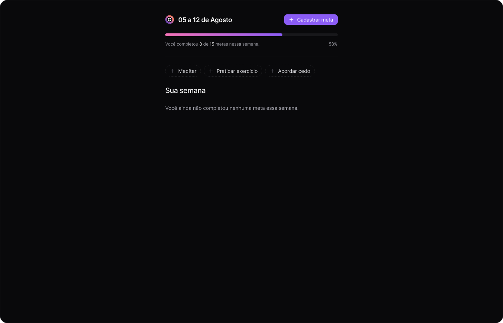
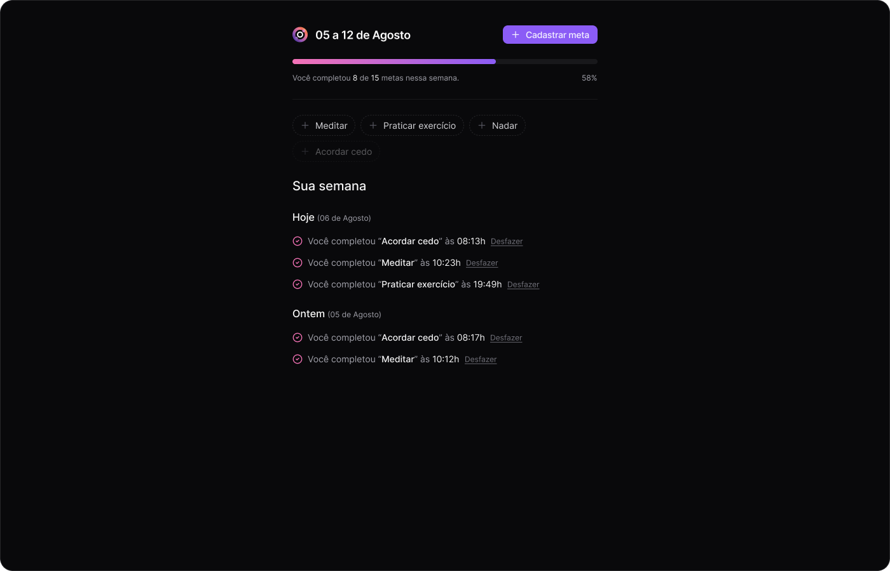

# in.orbit

**io.orbit** é uma aplicação full-stack para gerenciamento de metas, desenvolvida usando **Fastify** como framework de backend, **Drizzle ORM** para interação com o banco de dados, e outras bibliotecas para validação e geração de documentação de API. A aplicação permite criar metas, registrar conclusões e gerar relatórios semanais.

## API

- [Cliquei aqui para ver a api](https://github.com/andrelinos/nwl-18/tree/main/server)

## WEB

- [Clique aqui para ver o web](https://github.com/andrelinos/nwl-18/tree/main/web)

## Imagens do projeto

  
  
  
  
